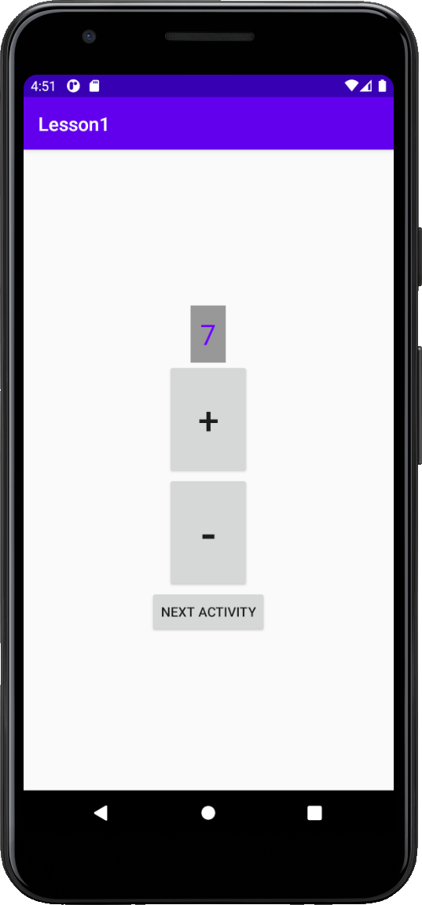
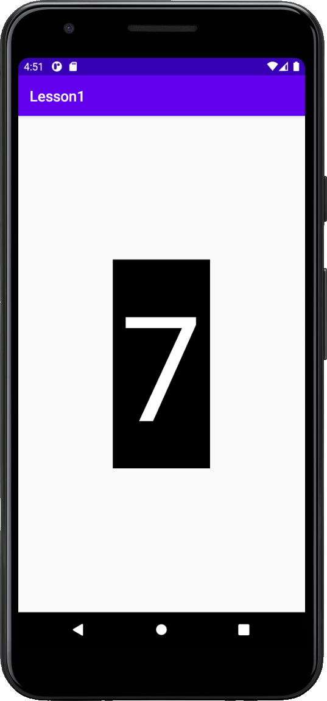

## Lesson 1
Небольшое приложение, чтобы потренироваться пользоваться layout'ами, и переключениями activivty.  
Представляет из себя 2 актвити:
1. Счётчик с 3 кнопками: увеличить счётчик (+), уменьшить счётчик (-), открыть следующее активити (NEXT ACTIVITY)
2. Тот же счётчик, но большой и без кнопок. При этом значение счётчика передаётся из первого активити во второе
 
 ### Activity 1

### Activity 2

